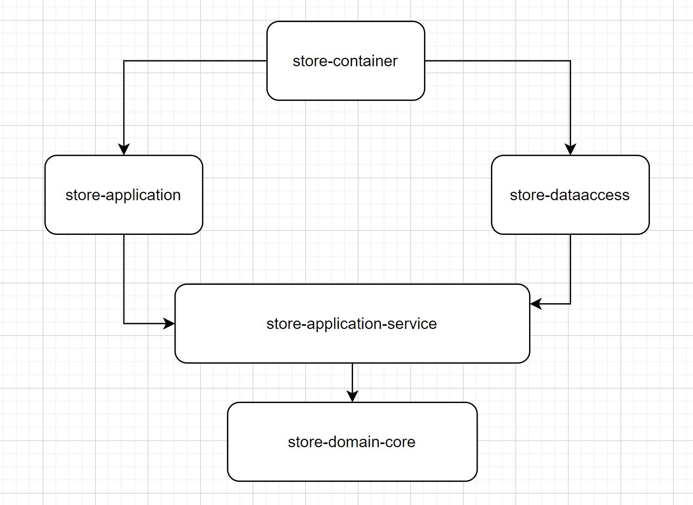

# Simple-Store


## Índice
<!-- TOC -->
* [Simple-Store](#simple-store)
  * [Enunciado](#enunciado)
  * [Campos:](#campos-)
  * [Se pide:](#se-pide-)
* [Domain Driven Design o DDD](#domain-driven-design-o-ddd)
* [Aquitectura hexagonal](#aquitectura-hexagonal)
* [Gráfico de dependencias](#grfico-de-dependencias)
* [Dockerización](#dockerizacin)
* [Levantar el servidor](#levantar-el-servidor)
<!-- TOC -->

## Enunciado
En la base de datos de comercio electrónico de la compañía disponemos de la tabla PRICES que refleja el precio final (pvp) y 
la tarifa que aplica a un producto de una cadena entre unas fechas determinadas. A continuación se muestra un ejemplo de la tabla con los campos relevantes:

PRICES
 
| BRAND_ID | START_DATE           | END_DATE            | PRICE_LIST | PRODUCT_ID | PRIORITY | PRICE  | CURR |
|----------|----------------------|---------------------|------------|------------|----------|--------|------|
| 1        | 2020-06-14-00.00.00  | 2020-12-31-23.59.59 | 1          | 35455      | 0        | 35.50  | EUR  |
| 1        | 2020-06-14-15.00.00  | 2020-06-14-18.30.00 | 2          | 35455      | 1        | 25.45  | EUR  |
| 1        | 2020-06-15-00.00.00  | 2020-06-15-11.00.00 | 3          | 35455      | 1        | 30.50  | EUR  |
| 1        | 2020-06-15-16.00.00  | 2020-12-31-23.59.59 | 4          | 35455      | 1        | 38.95  | EUR  |

## Campos: 
- BRAND_ID: foreign key de la cadena del grupo.
- START_DATE , END_DATE: rango de fechas en el que aplica el precio tarifa indicado.
- PRICE_LIST: Identificador de la tarifa de precios aplicable.
- PRODUCT_ID: Identificador código de producto.
- PRIORITY: Desambiguador de aplicación de precios. Si dos tarifas coinciden en un rago de fechas se aplica la de mayor prioridad (mayor valor numérico).
- PRICE: precio final de venta.
- CURR: iso de la moneda.

## Se pide:
Construir una aplicación/servicio en SpringBoot que provea una end point rest de consulta  tal que:
* Acepte como parámetros de entrada: fecha de aplicación, identificador de producto, identificador de cadena.
* Devuelva como datos de salida: identificador de producto, identificador de cadena, tarifa a aplicar, fechas de aplicación y precio final a aplicar.
* Se debe utilizar una base de datos en memoria (tipo h2) e inicializar con los datos del ejemplo, (se pueden cambiar el nombre de los campos y añadir otros nuevos si se quiere, elegir el tipo de dato que se considere adecuado para los mismos).
* Desarrollar unos test al endpoint rest que  validen las siguientes peticiones al servicio con los datos del ejemplo:
  
  - Test 1: petición a las 10:00 del día 14 del producto 35455   para la brand 1
  - Test 2: petición a las 16:00 del día 14 del producto 35455   para la brand 1
  - Test 3: petición a las 21:00 del día 14 del producto 35455   para la brand 1
  - Test 4: petición a las 10:00 del día 15 del producto 35455   para la brand 1
  - Test 5: petición a las 21:00 del día 16 del producto 35455   para la brand 1


# Domain Driven Design o DDD

El diseño guiado por el dominio, en inglés: domain-driven design (DDD), es un enfoque para el desarrollo de software con necesidades complejas mediante una profunda conexión entre la implementación y los conceptos del modelo y núcleo del negocio.

Las premisas del DDD son las siguientes:
- Poner el foco primario del proyecto en el núcleo y la lógica del dominio.
- Basar los diseños complejos en un modelo.
- Iniciar una creativa colaboración entre técnicos y expertos del dominio para interactuar lo más cercano posible a los conceptos fundamentales del problema.

# Aquitectura hexagonal 

La arquitectura hexagonal, también conocida como arquitectura de puertos y adaptadores, es un patrón de diseño de software que tiene como objetivo principal separar las responsabilidades de cada componente de un sistema. Esta arquitectura se basa en la idea de que las aplicaciones deben ser independientes de la tecnología subyacente y, por lo tanto, fácilmente intercambiables.

# Gráfico de dependencias
- Según la arquitectura implementada, sólo el módulo **store-container** tiene acceso a todos los módulos.
- La capa de negocio (store-application-service/store-domain-core) no tienen dependencias.



# Dockerización

El proyecto está dockerizado con una imagen multistage, para evitar que el código fuente acabe en el contenedor de producción y así aligerar la imagen.

# Levantar el servidor

Una opción es usar Docker:

```
docker compose up
```

O, directamente con Maven:

```
./mvnw spring-boot:run
```

Se usa elementos en preview de Java 17, por lo que es posible que tengamos que establecer la variable de entorno `JAVA_TOOL_OPTIONS=--enable-preview`.